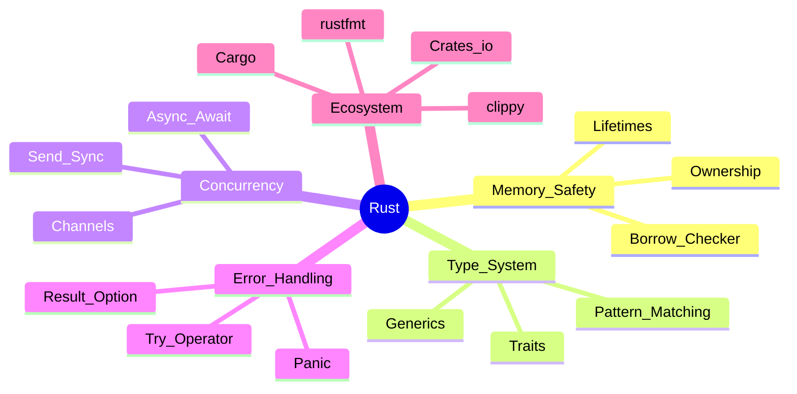

# Ejemplo · Aprender Rust desde Cero

> Sesión real Workflow 1 · de Escala 0 a Escala 1 en 4 horas. Caso de uso para activar `coach-aprender`.

**Persona**: Javier · Backend Senior con 8 años de experiencia en Java/Python · Escala 0 en Rust.
**Objetivo**: tener vocabulario y mapa del campo para decidir si invertir 64h en aprehender Rust.
**Tiempo bloqueado**: 4 horas · sábado mañana.
**Output esperado**: BoK + glosario + concept map + decisión informada (continuar o no).

---

## Cronograma real

### 0:00-0:15 · Declaración de intención

```markdown
TEMA: Rust (lenguaje de programación)
POR QUÉ: Considero migrar de Java a Rust en 2026 · evaluar costo/beneficio
ESCALA ACTUAL: 0 (sé que existe pero no he escrito una línea)
ESCALA OBJETIVO HOY: 1 (Curioso · puedo mapear el campo)
TIEMPO HOY: 4 horas
HIPÓTESIS INICIAL: "Rust es más seguro que Java pero más difícil"
```

Guardé en `~/aprender-aprehender/temas/rust/00-declaracion.md`.

### 0:15-1:00 · Triangulación Blueprint (3 IAs en paralelo)

Pegué el Prompt #1 en 3 tabs simultáneamente:

#### ChatGPT (5 min)
> "Rust es un lenguaje de programación de sistemas diseñado por Mozilla...
> [BoK con 6 subtemas: ownership, borrow checker, lifetimes, traits, async, ecosystem]
> [Glosario de 22 términos]
> [5 papers/libros recomendados: The Rust Programming Language, Rust for Rustaceans, Programming Rust]
> [Autoridades: Steve Klabnik, Niko Matsakis, Carol Nichols]"

#### Claude (5 min)
> [BoK con 5 subtemas similares: ownership, types, error handling, concurrency, ecosystem]
> [Glosario de 18 términos]
> [4 fuentes: tRPL, Rustonomicon, Programming Rust + 1 paper de la fundación Rust]
> [Autoridades: Klabnik, Matsakis, Nichols + Aaron Turon]
> Notable: Claude marcó algunos items con [VERIFICAR]

#### Gemini (5 min)
> [BoK con 7 subtemas: agregó "macros" y "WASM"]
> [Glosario de 25 términos]
> [5 fuentes incluyendo blog posts]
> [Autoridades: Klabnik · pero también listó "Linus Torvalds" como autoridad por aceptar Rust en kernel · interesante pero no fundacional]

Guardé las 3 respuestas en `~/aprender-aprehender/temas/rust/`.

### 1:00-2:00 · Consolidación + tabla triangulación

Ejecuté:
```bash
python scripts/triangulation.py \
  --files chatgpt.md claude.md gemini.md \
  --output triangulacion-rust.md
```

**Resultado**:

| Item | ChatGPT | Claude | Gemini | Veredicto |
|---|:---:|:---:|:---:|---|
| ownership | ✅ | ✅ | ✅ | 🟢 CONFIRMED |
| borrow checker | ✅ | ✅ | ✅ | 🟢 CONFIRMED |
| lifetimes | ✅ | ✅ | ✅ | 🟢 CONFIRMED |
| traits | ✅ | ✅ | ✅ | 🟢 CONFIRMED |
| async/await | ✅ | ✅ | ✅ | 🟢 CONFIRMED |
| macros | ❌ | ❌ | ✅ | 🔴 SOSPECHOSO 1/3 |
| WASM | ❌ | ❌ | ✅ | 🔴 SOSPECHOSO 1/3 |
| error handling | ✅ | ✅ | ❌ | 🟡 REVISAR · Gemini omitió |
| Klabnik · autor | ✅ | ✅ | ✅ | 🟢 CONFIRMED |
| Linus Torvalds · autor | ❌ | ❌ | ✅ | 🔴 SOSPECHOSO |
| Aaron Turon | ❌ | ✅ | ❌ | 🔴 SOSPECHOSO 1/3 |

**Análisis**:
- 5 subtemas core son CONFIRMED · seguro incluirlos en BoK final
- "macros" y "WASM" son nichos · NO son core de Rust como lenguaje
- "error handling" es CORE · Gemini debió omitirlo · incluir
- Linus Torvalds NO es autor de Rust (autoridad reciente que adoptó · diferente)
- Aaron Turon es real (co-creator del compilador) · validar manualmente

### 2:00-2:30 · Fact-Check cruzado (Prompt #4)

Pegué las 3 respuestas consolidadas en Perplexity con Prompt #4:

**Output Perplexity (extracto)**:
- "Steve Klabnik · autor de The Rust Programming Language" → [CONFIRMED] · libro existe
- "Linus Torvalds · autor de Rust" → [HALLUCINATION] · es kernel maintainer que aceptó Rust drivers, no autor de Rust
- "Aaron Turon · contribuidor temprano" → [CONFIRMED] · Mozilla Research lead 2014-2017
- "Niko Matsakis · trait system" → [CONFIRMED] · arquitecto del trait system, blog matsakis.net

Eliminé Linus Torvalds del BoK · agregué Aaron Turon como confirmado.

### 2:30-3:00 · Concept Map mermaid



Glosario consolidado: 24 términos con tags `[DOC]` (12), `[INFERENCIA]` (8), `[SUPUESTO]` (4).

### 3:00-3:30 · NotebookLM Setup

1. Creé notebook "Rust Foundations"
2. Importé como sources:
   - Las 3 respuestas IA (post fact-check)
   - Tabla de triangulación
   - Concept map mermaid
   - Glosario
3. Ejecuté Prompt #7 (Notebook Audit) → veredicto 🟡 BUENO · sugerencia: añadir capítulo 1 de The Rust Book
4. Configuré coach con Prompt #2:
   - [TU TEMA] = "Rust"
   - [NIVEL OBJETIVO] = "Escala 1 Curioso (validar interés)"
   - [CONTEXTO] = "Backend senior 8 años Java/Python · evaluar inversión 64h en Rust"

### 3:30-4:00 · Primera sesión con coach + decisión

**Mi pregunta inicial**: "Coach, basado en mi background, ¿Rust me dará beneficio significativo o es marginal?"

**Coach (Prompt #2 activo)**:
> Buena pregunta · pero antes te respondo, déjame entender:
> - ¿En qué área específica de tu trabajo sufres más con Java/Python? (concurrency, memory, performance, otra)
> - ¿Cuáles son los proyectos donde un bug de memoria costó tiempo significativo?

**Yo**: "He tenido 2 incidentes serios de race conditions en Java este año, y APIs Python que no escalaron bien."

**Coach**:
> Esos son dos puntos exactos donde Rust brilla:
> 1. Race conditions: ownership + Send/Sync trait te previenen en compile-time (vs runtime en Java)
> 2. Performance Python: Rust te daría 10-50x sin perder seguridad
>
> Pero espera · antes de "deberías aprender Rust", piensa: ¿podrías invertir 64h en los próximos 3 meses sin sacrificar otro objetivo? Y ¿tienes proyecto real donde aplicar Rust en producción?
>
> Si SÍ a ambos: alta probabilidad de ROI positivo.
> Si NO al segundo: aprender sin proyecto = 50% del aprehender se evapora en 6 meses.

**Yo**: "Tengo un proyecto en mente: re-escribir el procesador de eventos del backend (actualmente Python, latencia inaceptable)."

**Coach**:
> Ahí tienes tu fit perfecto. Recomendación:
> - Workflow 2 (Sprint 20h en 4 semanas) sobre Rust core
> - PoC pequeño en el procesador de eventos (8h adicionales)
> - Si funciona → Workflow 3 + reescritura completa (200h en 3 meses)
>
> Decisión hoy: ¿Workflow 2? Te agendo en calendario.

**Yo**: "Sí, agéndalo. Lunes empiezo."

---

## Quality Gate G-Aprender · pasado ✅

```
[✅] BoK triangulado en 3+ IAs (eliminado 2 hallucinations)
[✅] Glosario con 24 términos (objetivo ≥15)
[✅] Concept map mermaid generado
[✅] 4 fuentes primarias verificadas (tRPL, Rust Reference, Rustonomicon, Programming Rust)
[✅] Auditor cruzado · 1 hallucination crítico eliminada (Linus como autor)
[✅] NotebookLM configurado con coach activo
[✅] Primera sesión con coach exitosa (5 preguntas test)
[✅] BONUS: decisión informada con caso de aplicación real
```

## Documentación final

```bash
# Actualizar estado
python scripts/progress_tracker.py --add-tema "Rust" --objetivo 3 --horas-obj 64
python scripts/progress_tracker.py --update "Rust" --escala 1 --notas "BoK validado, pivot decision: WF2 + PoC procesador eventos"

# Generar plan Sprint
python scripts/desatraso_planner.py --tema "Rust" --tiempo 20h --escala-actual 1 \
  --save ~/aprender-aprehender/temas/rust/plan-sprint.md
```

## Lecciones aprendidas

### Lo que funcionó
1. **Triangulación temprana**: detectó "Linus Torvalds como autor" antes de que entrara a mi BoK
2. **Coach socrático**: me llevó a la pregunta correcta ("¿tienes proyecto real?") en lugar de validar ciegamente "deberías aprender"
3. **Decisión basada en fit**, no en hype

### Lo que costó
- 2.5 horas pasaron volando · subestimé tiempo de consolidación
- "Macros" y "WASM" me confundieron 10 min hasta darme cuenta que eran nichos, no core

### Próximos pasos
1. Lunes: Workflow 2 (Sprint Rust core · 4 semanas)
2. Semana 2: PoC procesador eventos (8h adicionales)
3. Si PoC valida hipótesis: Workflow 3 + reescritura producción

---

## Tiempo total: 3:55 horas
## Veredicto: ✅ Escala 1 alcanzada · plan Sprint agendado para lunes

---

> **Ejemplo Aprender Rust** del Playbook Aprender · Aprehender · (R)Evolucionar v2.0.0 · MetodologIA · CC BY-NC-SA 4.0
> *Este es un ejemplo realista, no un caso real específico de Javier.*
